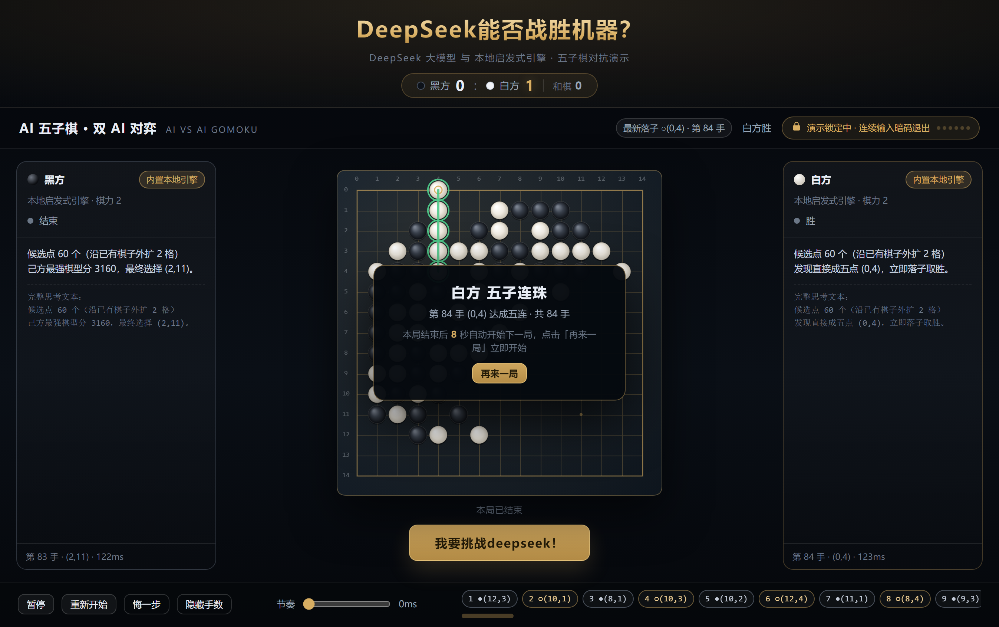
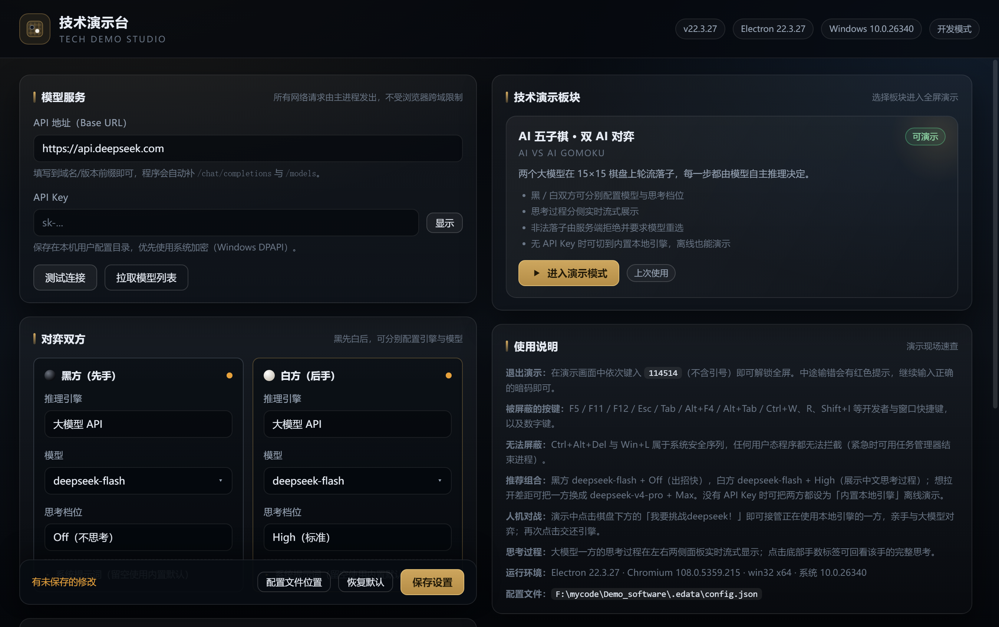

# 技术演示台 · TechDemoStudio

[](https://github.com/Bit-Workshop-Team/TechDemoStudio/actions/workflows/test.yml)
[](https://github.com/Bit-Workshop-Team/TechDemoStudio/actions/workflows/build.yml)
[](https://github.com/Bit-Workshop-Team/TechDemoStudio/releases)
[](LICENSE)


一个用于在**大屏 / 展厅 / 现场**展示多项技术的 Windows 桌面软件。

- 启动即进入**设置界面**：填 API Key、配置演示参数、选择要展示的技术板块；
- 进入某个板块后**全屏锁定**并屏蔽大部分系统快捷键；
- 退出全屏的唯一方式是**连续按 `1` `1` `4` `5` `1` `4`**；
- 第一个板块是「**AI 五子棋 · 双 AI 对弈**」（参考 [dsh-gomoku](https://github.com/omdsh-dev/dsh-gomoku) 的规则与提示词设计），其余板块为占位页；
- **支持 Windows 7 SP1 及以上**，使用 Electron 22（最后一个官方支持 Win7 的版本）打包，交付 NSIS 安装包。



---

## 1. 环境要求

| 运行环境 | 要求 |
| --- | --- |
| 操作系统 | **Windows 7 SP1 / 8 / 8.1 / 10 / 11（x64 或 x86）** |
| 必需组件 | Win7 需已安装 **SP1**；安装包自带 Electron/Chromium 运行时，**不需要**额外装 WebView2 或 .NET |
| 联网 | 使用「大模型 API」引擎时需要能访问配置的 API 地址；不联网可用内置本地引擎完整演示 |

> 为什么是 Electron 22：Electron 22 是**最后一个官方支持 Windows 7 的版本**（内置 Chromium 108），
> 23 及以后要求 Windows 10+。安装脚本 `build/installer.nsh` 会在安装前用 `${AtLeastWin7}` 检查系统版本，
> 低于 Win7 直接中止安装并弹窗提示。

---

## 2. 快速开始

### 2.1 用安装包（推荐）

1. 运行 `dist/TechDemoStudio-1.0.0-setup.exe`（同时包含 x64 与 ia32，安装程序会自动选择）；
   - 只想装单架构可用 `TechDemoStudio-1.0.0-x64-setup.exe` 或 `TechDemoStudio-1.0.0-ia32-setup.exe`；
2. 按向导安装（非一键安装，可自选目录，会创建桌面快捷方式「技术演示台」）；
3. 启动后先进入设置界面，按第 4 节填好 Key 再进入演示。

### 2.2 从源码运行

```bat
npm install
npm start          # 或 npm run dev（带开发模式标记）
```

---

## 3. 使用流程

1. 启动软件 → **设置界面**（深色主题，左侧「模型服务」「对弈双方」，右侧「技术演示板块」「使用说明」）；
2. 填 **API 地址** 与 **API Key**，可点「测试连接」验证、点「拉取模型列表」把服务端模型名填进下拉框；
3. 配置「对弈双方」（黑先白后，双方可分别设置）：
   - 推理引擎：**大模型 API** 或 **内置本地引擎**（离线启发式算法，选它时模型与思考档位会自动隐藏）；
   - 模型：自绘暗色下拉，预置 `deepseek-flash`（V4.1-Flash · 快，支持思考）与 `deepseek-v4-pro`（V4-Pro · 推理更强），也可手填任意模型名；
   - 思考档位：**Off / Low / High / Max** 四档；
   - 系统提示词：可展开编辑，也可一键恢复默认；
4. 在「技术演示板块」中点击卡片上的「进入演示」即进入**全屏演示**；
   - 「AI 五子棋 · 双 AI 对弈」状态为「可演示」；
   - 其余卡片为「待开发」，进入后是占位页，同样用 `114514` 退出；
5. 演示画面上方是金色大标题 **「DeepSeek能否战胜机器？」**，标题正下方是一条实时比分：
   `● 黑方 0 : ● 白方 0  和棋 0`，每局终了自动累加，进入演示模式时归零；
   棋盘左右两侧实时流式展示双方的思考过程；
6. 想人机对战：点棋盘正下方那颗放大的「**我要挑战deepseek！**」按钮，你会接管正在使用本地引擎的一方
   （若双方都是大模型则接管白方），在棋盘上点交叉点落子；**你落子后 AI 会立刻接着走**，
   AI 走完再自动把回合交回给你（面板显示「等你落子」），再点一次同一按钮即交还引擎；
7. 退出演示：**连续按指定暗码退出**（界面上有暗码进度点提示，可在演示里关闭提示）。
   按错一位会立刻重置：暗码徽标变红抖动、文案变成「暗码错误 · 已重置，请重新输入」，并弹一条提示。
   演示界面**故意不提供鼠标退出按钮**，唯一出口就是这串暗码；万一需要强制结束，
   按 `Ctrl+Alt+Del` 打开任务管理器结束进程（这是 Windows 保留的安全注意序列，任何用户态程序都拦不住）。
   在不希望被强制结束的展机上，请用组策略禁用任务管理器或启用 Windows 展台模式。

> 没有任何 API Key 也能完整演示：把双方引擎都设为「内置本地引擎」即可。

---

## 4. 设置项说明



| 分组 | 设置 | 默认值 | 说明 |
| --- | --- | --- | --- |
| API 接口 | 服务地址 | `https://api.deepseek.com` | OpenAI 兼容，自动补 `/v1`、`/chat/completions` |
| | API Key | 空 | 用 Electron `safeStorage`（Windows DPAPI）加密后存于用户数据目录；不可用时退化为明文并提示 |
| | 测试连接 / 获取模型 | — | 校验 Key、拉取模型列表填进模型下拉框 |
| AI 五子棋 | 黑方 / 白方 引擎 | 黑=云端 API，白=内置本地引擎 | 双方独立；选本地引擎时模型与档位自动隐藏 |
| | 黑方 / 白方 模型 | 均为 `deepseek-flash` | 自绘暗色下拉（预置 `deepseek-flash` / `deepseek-v4-pro`），也可手填任意模型名 |
| | 思考档位 | 黑 Off / 白 High | **Off / Low / High / Max**；DeepSeek 官方端点会同时下发 `thinking`（Off 显式关闭，V4 起默认开启思考），第三方端点只发 `reasoning_effort` |
| | 系统提示词 | dsh-gomoku 默认提示词全文 | 含规则、术语、棋盘格式、返回 JSON 格式与正反示例；可恢复默认 |
| 对局参数 | 单步超时 | 300000 ms（5 分钟） | 范围 5000–3600000 |
| | 单步输出上限 | 8192 tokens | 防止推理模型输出失控 |
| | 非法回复重试次数 | 3 | 越界 / 占位 / 格式错 / 空回复都会带**针对性纠正提示 + 空点示例**反馈重试 |
| | 落子节奏 | 600 ms | 演示观感用，可设 0 立即连下 |
| 演示 | 退出暗码 | 默认`114514` | 演示中连续输入即退出全屏 |
| | 显示暗码进度点 | 开 | 关闭后界面不显示进度点，暗码仍然有效 |
| 本地引擎 | 棋力档位 | 2（1–3） | 内置启发式评分引擎的强度 |

配置保存位置：`%APPDATA%\TechDemoStudio\config.json`（设置界面底部有「配置文件位置」按钮可直接打开）。

---

## 5. 板块一：AI 五子棋 · 双 AI 对弈

**规则**：15 × 15 棋盘，**无禁手**（双三、双四、长连均合法），连成五子及以上即胜，棋盘下满为和棋。

**核心设计（沿用 dsh-gomoku）**：

- 每一步落子都由**推理模型自主决定**，不附加搜索算法或启发式剪枝；
- 系统提示词里写明棋盘格式、术语解释、胜负规则、基本战术与严格 JSON 返回格式；
- 每步的 user message 只给：棋盘文本（首行列号、每行以行号开头、每格 `B`/`W`/`·`）、AI 执子方，以及重试时的
  上次非法回复、拒绝原因、**纠正提示**（越界 / 非整数 / 落在已有棋子上 / 格式不合规 / 空回复各不相同，并附当前空点坐标示例）；
- 要求模型只返回 `{"move": [row, col]}` / `{"draw": true}` / `{"error": "一句话"}`；
  坐标必须是 0–14 的整数且落在空点上，否则由服务端拒绝并把原因反馈给模型重试（最多 `maxAttempts` 次）；
- **思考过程分侧展示**：黑方推理在左、白方推理在右，流式增量输出（增量按 90 ms 批量写 DOM、
  超长只保留最后 14000 字，避免长推理文本把界面拖卡）；点击下方落子记录某一手可回放该手完整推理；
- **人机对战（我要挑战deepseek！）**：点棋盘下方放大的按钮即可接管正在使用本地引擎的一方
  （双方都是大模型则接管白方）。你落子后主循环立刻恢复，AI 自动接续落子；AI 走完一手再把回合交回给你
  （面板回到「等你落子」，顶部提示「轮到你落子」）；按钮变成「交还引擎（AI 接管）」，再点一次恢复纯 AI 对弈；
- **暂停 / 手动接管**：暂停后点击棋盘即可由人落子（黑先白后轮流），继续后 AI 接着下；
- **顶部实时比分**：标题正下方一条比分条（黑方 : 白方 + 和棋数），每局分出胜负或和棋后自动累加 1；
  「再来一局」与「重新开始」都不会清零也不会重复累加；悔掉刚刚分出胜负的那一局会把比分回退；
  进入演示模式时比分归零；
- **悔一步 / 重新开始 / 手数标记**，以及终局横幅（黑或白五子连珠 / 和棋）与「再来一局」；
  横幅显式设置行高与层级（`z-index: 40`），标题 / 说明 / 按钮三行不再互相压叠，且完整落在可视区内；
- **终局自动续场**：横幅上显示「本局结束后 N 秒自动开始下一局」倒计时，10 秒内没有任何操作
  就自动开下一局（延续比分，不重复计分）；点「再来一局」立即开始，点暂停 / 悔一步 / 接管也会取消倒计时；
- 底部落子记录是一条**横向滚动、不换行**的条带（38 px 高、底部留 8 px 给滚动条），手数再多也不会把底栏顶高，
  横向滚动条也不会压住落子标签；
- 非法落子的**纠正提示**：越界、非整数、落在已有棋子上、格式不合规、空回复等每种拒绝原因都带一条
  针对性的纠正提示（含「只能落在显示为 `·` 的空点」与 12 个空点坐标示例），随重试的 user message 一起发回；
- API 连续失败时**自动降级**为该方的内置本地引擎继续演示（面板徽标显示「已降级」），保证无人值守不中断。

---

## 6. 全屏锁定与退出暗码

进入演示（`demo:start`）时主进程会：

- 窗口全屏、置顶、隐藏任务栏；
- 通过 `globalShortcut` 注册一批要屏蔽的系统快捷键（本机实测成功注册 **31** 个）；
- 同时对窗口内的按键做 `before-input-event` 拦截，作为 `globalShortcut` 被系统占用时的第二道防线；
- 用一个 1.2 s 的焦点抢占定时器缓解 `Alt+Tab` 切出。

`F12`、`Alt+F4`、`Alt+Tab`、`Ctrl+Esc`、`Ctrl+Shift+Esc`、`Super`、`PrintScreen` 等
11 个键属于**系统保留**，`globalShortcut` 注册会失败并回退到窗口级拦截——Windows 不允许用户态程序彻底屏蔽它们，
这是预期行为（真正的现场防护请配合展台模式/组策略）。

暗码逻辑在 `src/main/kiosk.js`：按键按来源去重（同一物理键可能被 `globalShortcut` 与 `before-input-event`
双通道投递，同键异源 80 ms 内只记一次；同键同源 25 ms 内视为自动重复），按对一位点亮一个进度点，
**按错立即重置**（若错键恰好是暗码首位则保留它），输满 `114514` 后退出全屏、还原置顶/任务栏并回设置界面。

---

## 7. 新增一个技术板块

1. 编辑 `src/shared/boards.js`，在 `list()` 里加一项：

```js
{ id: 'myboard', name: '我的板块', en: 'MY BOARD', status: 'ready', order: 6,
  tagline: '一句话说明', highlights: ['要点一', '要点二'] }
```

2. 在 `src/renderer/index.html` 里加一个 `<section class="view" id="view-myboard">`，
   或在 `src/renderer/lib/demo.js` 的视图切换里挂上自己的渲染逻辑；
3. 需要主进程能力（网络、文件、系统 API）就在 `src/main/main.js` 注册新的 IPC，并在 `src/preload/preload.js` 暴露。

`status: 'planned'` 的板块会自动渲染成带锁的占位页，点击照样进全屏演示，用 `114514` 退出。

---

## 8. 目录结构

```
src/
  main/            Electron 主进程
    main.js            窗口 / 全屏演示 / 全部 IPC 通道 / 单实例锁
    config-store.js    配置读写、默认值、旧模型名迁移、档位白名单、safeStorage 加密
    llm-client.js      请求体构造（thinking / reasoning_effort）、流式解析、超时与重试
    gomoku-service.js  棋盘校验、非法落子反馈重试、降级本地引擎
    local-engine.js    内置离线启发式五子棋引擎（三档棋力）
    kiosk.js           全屏锁定、系统快捷键屏蔽、暗码校验与进度回调
  preload/preload.js    contextBridge 暴露的 window.demoAPI（llm / config / gomoku / demo / lock）
  renderer/
    index.html          设置界面 + 演示界面 + 占位板块页
    app.js              渲染层入口与视图切换
    styles.css          全部样式（深色玻璃拟态主题）
    lib/settings.js     设置界面表单、自绘模型下拉、引擎切换、保存回读
    lib/demo.js         演示主控：主循环、人机对战、流式节流、终局横幅、暗码反馈
    lib/gomoku-game.js  棋局状态、落子、悔棋、胜负判定
    lib/board-renderer.js Canvas 棋盘（坐标、星位、最后一手、手数、五连高亮）
    lib/ui.js           toast / 对话框 / 小工具
  shared/             主进程与渲染层共用（UMD）
    gomoku-rules.js     15×15 规则、棋盘文本、五连检测
    boards.js           技术板块清单
    default-prompts.js  默认系统提示词与 user message 构造
tools/
  self-test.js        71 项纯逻辑自检（node tools/self-test.js）
  smoke-electron.js   82 项端到端冒烟（真实 Electron + 真实 IPC + 真实 Kiosk + 截图）
  make-icon.js        按 electron-builder 要求生成 icon.png / icon.ico
build/                installer.nsh（Win7 版本校验）；icon.ico / icon.png 由 npm run icon 生成（不入库）
docs/screenshots/     README 配图（设置界面、演示界面）
.github/
  workflows/test.yml   CI：只跑逻辑自检（npm ci + npm test），push / PR 时触发
  workflows/build.yml  CD：构建双架构安装包，打 tag 时自动发 draft Release
  dependabot.yml      依赖更新（electron 的 semver-major 被忽略，以保住 Win7 兼容）
electron-builder.yml  打包配置（NSIS、x64+ia32、asar）
LICENSE               MIT
SECURITY.md           安全策略、敏感数据说明、已知风险与部署加固建议
THIRD-PARTY-NOTICES.md 第三方组件与许可（含 dsh-gomoku 的 MIT 署名）
```

---

## 9. 开发与构建

```bat
npm install                # 安装依赖（electron 22.3.27 + electron-builder 26.15.3）
npm start                  # 运行
npm run dev                # 运行（开发模式标记，界面右上角显示版本与「开发模式」）
npm test                   # 71 项纯逻辑自检
npm run test:e2e           # 82 项 Electron 端到端（真实 IPC + 真实 Kiosk + 暗码退出），并截取 shots/ 界面截图
npm run icon               # 重新生成图标
npm run dist               # 打包 NSIS：x64 + ia32 + 二合一（产出在 dist/）
npm run dist:x64           # 只打 x64
npm run dist:ia32          # 只打 ia32（给 32 位 Win7）
npm run pack               # 只解包不装包（dist/win-unpacked）
```

打包后要复测 asar 内的应用本体：

```bat
set SMOKE_APP_ROOT=dist\win-unpacked\resources\app.asar\src
npm run test:e2e
```

### 9.1 持续集成与自动发版（GitHub Actions）

CI 与 CD 拆成两个工作流，各自独立、互不牵连：

**`.github/workflows/test.yml`（CI，push / PR / 手动）**

| Job | 内容 |
| --- | --- |
| `test` | `npm ci` + `npm test`（71 项纯逻辑自检，几十秒） |

**`.github/workflows/build.yml`（CD，打 `v*` 标签 / 手动）**

| Job | 内容 |
| --- | --- |
| `verify` | 出包前再自检一遍（同上 `npm ci` + `npm test`），不通过就不出包 |
| `build` | Windows 上 `npm run icon` + `npm run dist`，上传 3 个安装包与 `win-unpacked` 应用本体为 artifact（缓存 Electron / electron-builder 下载目录） |
| `release` | 下载安装包 → 生成 `SHA256SUMS.txt` → 用 `softprops/action-gh-release` 创建 **draft Release** |

这样每次提交只跑几十秒的逻辑自检，而出包/发版这类重活只在需要时执行。
**端到端冒烟不进 CI**（需要真实 GUI 窗口），在本地跑：

```bat
npm ci && npm test                # CI 等价命令（71 项）
npm run test:e2e                  # 本地 82 项端到端（含截图）
npm run icon && npm run dist      # 本地出安装包（不依赖 CI 也能发版）
```

发布一个版本（打 tag 即自动构建并生成 Release 草稿）：

```bat
git tag v1.0.0
git push origin v1.0.0
```

跑完后到仓库的 Releases 页面确认草稿内容再点发布；想手工发版就用上面的本地打包命令，
并把 `Get-FileHash dist\TechDemoStudio-*.exe -Algorithm SHA256` 的结果一并贴进 Release 说明
（`SECURITY.md` 建议使用者用校验和核对安装包）。

依赖更新由 Dependabot 每周提 PR（`electron` 的 semver-major 被刻意忽略，见 `SECURITY.md` 第 1 条）。

---

## 10. 已验证结果

| 验证 | 结果 |
| --- | --- |
| `node tools/self-test.js` | **71 / 71 通过**（规则、棋盘文本、默认提示词、**非法落子六种拒绝原因各自带针对性纠正提示、重试消息含纠正提示与空点示例、合法落子/和棋仍放行**、请求体构造 `thinking`/`reasoning_effort`、旧模型名迁移、思考档位白名单、退出口令的输错重置与双通道去重、本地引擎三档合法性与耗时、四连必成五、对手四连必封堵、黑 L3 vs 白 L2 自对弈到分胜负） |
| `npm run test:e2e`（源码） | **82 / 82 通过**：设置渲染与保存回读、**CSP 已配置且真实拦截渲染层网络请求（`connect-src` 违规事件）**、旧模型名保存后迁移为 `deepseek-flash`、`low` 档位可保存、自绘模型下拉可展开/筛选/选中、本地引擎时模型与档位隐藏、顶部大标题文本与尺寸、**标题下方实时比分（进入演示归零 / 一局结束累加 / 再来一局保留 / 第二局继续累加 / 悔掉已计分对局回退）**、「我要挑战deepseek！」按钮在棋盘下方且已放大、人机对战接管与交还、**人落子后 AI 自动接续落子、AI 落子后回合自动交回人类**、人工点击棋盘落子、思考面板流式输出、终局横幅弹出且标题/说明/按钮不重叠不被裁切、**终局横幅显示 10 秒自动续场倒计时且到点自动开下一局（不重复计分）、暂停会取消倒计时**、「再来一局」可重开新局、**手数条横向滚动条的 8 px 净空（不压住落子标签）**且底栏高度稳定、暗码进度点、输错暗码的红色抖动/红点/文案/toast 及恢复、Kiosk 进入与两轮退出、双通道投递去重、人手连按不丢键 |
| Kiosk 端到端 | 进入后 `locked=true`、成功注册 31 个全局快捷键；真实按键模拟：错误暗码 `114513` 不退出、正确暗码 `114514` 退出并回到设置界面、可重复进入退出 |
| 界面截图取证 | 端到端测试自动截取 `shots/01-settings.png`、`01b-model-combo.png`、`02-demo-headline.png`、`03-wrong-code.png`、`04-banner-win.png`（可用于回归对比） |
| 打包后复测 | `SMOKE_APP_ROOT=dist/win-unpacked/resources/app.asar/src` 再跑一次端到端，同样全部通过（证明 asar 内的应用本体可用） |
| `npm run dist` | 成功，产出 `dist/TechDemoStudio-1.0.0-setup.exe`（x64+ia32 二合一）、`-x64-setup.exe`、`-ia32-setup.exe` 与两个 `win*-unpacked` 目录 |

---

## 11. 已知限制与注意事项

- **演示中想强退**：只有暗码 `114514`（或任务管理器）。演示页不提供鼠标退出入口是刻意设计；
- **系统级快捷键**：`Alt+F4` / `Alt+Tab` / `Ctrl+Shift+Esc` 等由 Windows 保留，无法被用户态程序彻底屏蔽；
- **Win7 上的大模型直连**：Electron 22 内置 Chromium 108 支持 TLS 1.2，能直连 DeepSeek；若目标机器只支持旧版 TLS，请改用离线本地引擎；
- **API Key 存储**：优先用 Windows DPAPI（`safeStorage`）加密；极端环境下不可用时降级为明文并给出提示；
- **Electron 22 已 EOL**：为兼容 Win7 而锁定，底层 Chromium 存在上游不再修复的 CVE。界面完全离线 + 严格 CSP + 白名单 IPC 是主要缓解手段，**请只在受控演示机上运行**（详见 [`SECURITY.md`](SECURITY.md)）；
- **安装包未签名**：Windows 可能提示「未知发布者」，完整性请用 Release 附带的 `SHA256SUMS.txt` 校验；
- **构建期依赖告警**：`npm audit` 会报 `extract-zip` 的两个高危（经由 `electron` 的下载链路），只影响构建机器，产物不受影响且上游无修复版本；
- **暗码不是安全边界**：它只防现场误触，任务管理器/关机都能绕过；
- **本机验证范围**：开发机为 Windows 11（内部版本 26340），Win7 兼容性依据 Electron 22 的官方支持范围与安装脚本版本校验，未在真实 Win7 机器上实测过。

---

## 12. 开源与协作

| 项目 | 内容 |
| --- | --- |
| 许可 | **MIT**（见 [`LICENSE`](LICENSE)） |
| 第三方 | 默认提示词派生自 [dsh-gomoku](https://github.com/omdsh-dev/dsh-gomoku)（MIT），署名与依赖清单见 [`THIRD-PARTY-NOTICES.md`](THIRD-PARTY-NOTICES.md) |
| 安全问题 | 请走 GitHub 私密漏洞报告，**不要开公开 Issue**，见 [`SECURITY.md`](SECURITY.md) |
| 仓库里没有什么 | 不含任何 API Key、账号、邮箱、内网地址或机器名；`config.json`、测试日志、`shots/`、`.edata/` 等运行痕迹都在 `.gitignore` 里 |

首次发布到 GitHub：

```bat
git add -A
git commit -m "feat: TechDemoStudio 1.0.0（多技术板块演示台 + AI 五子棋板块）"
git remote add origin https://github.com/Bit-Workshop-Team/TechDemoStudio.git
git push -u origin main
```

推送后 Actions 会自动跑逻辑自检（`test.yml`）；之后打 `v1.0.0` 标签由 `build.yml` 自动构建并生成 Release 草稿。

欢迎 Issue / PR。提交前请确保 `npm test` 全绿；改动渲染层或主进程时请附一次 `npm run test:e2e` 的结果，
新增板块请按第 7 节的方式在 `src/shared/boards.js` 中登记。

